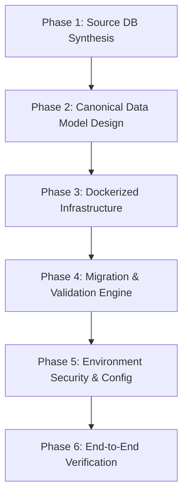

# Agent Instructions: SQL Server to PostgreSQL Canonical Migration

This document provides complete, reproducible **Agentic Instructions and Prompts** for an AI Coding Agent (e.g., Antigravity, Cursor, Claude Code, Copilot, or ChatGPT) to design, build, and verify an end-to-end relational database migration pipeline following a **Canonical Data Model (CDM)**.

---

## 1. Master Agent Prompt (Copy & Paste to Any Coding Agent)

```markdown
You are an expert Data Platform Engineer and Migration Architect. 
Your objective is to design, implement, and verify a complete, enterprise-grade, Docker-first Proof-of-Concept (POC) that migrates a relational SQL database (SQL Server) to PostgreSQL following a Canonical Data Model (CDM).

Context & Constraints:
1. The client has not shared their proprietary database yet. You must synthesize a realistic, highly complex enterprise sample database (minimum 20+ tables across 4 domain schemas) with diverse data types, foreign keys, identity columns, composite keys, check constraints, and seed data.
2. The migration must follow a Canonical Data Model (CDM):
   - Decouple source-specific technical debt.
   - Standardize table and column names to clean `snake_case`.
   - Map vendor types to PostgreSQL standards (DATETIME2/DATETIMEOFFSET -> TIMESTAMPTZ, BIT -> BOOLEAN, UNIQUEIDENTIFIER -> UUID, identity sequences).
3. The solution must be 100% Docker-based:
   - Provide `docker-compose.yml` orchestrating SQL Server 2022, PostgreSQL 16, auto-seeder, database inspector, and migration runner.
   - Zero host dependencies needed (no local Python, ODBC drivers, or databases required).
4. Security & Configuration:
   - ZERO hardcoded passwords or database names in Python scripts or Docker Compose.
   - All connection parameters must be loaded via `.env` (gitignored).
   - Provide a clean `.env.example` template containing only keys with empty values.
5. Verification:
   - Implement automated row-count reconciliation across 100% of tables.
   - Provide clean documentation (`README.md`, `GUIDE.md`, CDM specifications).

Execute this task autonomously step-by-step.
```

---

## 2. Detailed Agent Step-by-Step Execution Plan

When an agent executes this task, it must follow these 6 sequential phases:



---

### Phase 1: Synthesize Complex Source Database (`sql_server/`)

**Goal:** Create a realistic enterprise schema in SQL Server simulating an ERP/Sales platform.

**Requirements:**
- **Schema Separation**: Partition entities across at least 4 schemas (`core`, `inventory`, `sales`, `audit`).
- **Table Count**: Create 25+ relational tables.
- **Relational Complexity**:
  - Primary keys (`INT IDENTITY(1,1)` and `BIGINT IDENTITY(1001,1)`).
  - Foreign keys with cascading updates/deletes.
  - Self-referencing recursive hierarchies (e.g., `core.Employees.ManagerID -> core.Employees.EmployeeID`).
  - Composite unique keys and composite primary keys (e.g., `core.CustomerProfiles(CustomerID, ProfileType)`).
  - Check constraints (e.g., positive prices, valid status strings).
  - Diverse SQL Server data types: `NVARCHAR`, `VARCHAR`, `INT`, `BIGINT`, `DECIMAL(18,2)`, `BIT`, `DATETIME2`, `UNIQUEIDENTIFIER`, `VARBINARY`.
- **Files to produce**:
  - `sql_server/01_init_schema.sql`: Table definitions and constraints.
  - `sql_server/02_seed_data.sql`: Realistic corporate seed data across all tables.
  - `sql_server/03_views_procedures.sql`: Helper views and procedures.

---

### Phase 2: Design the Canonical Data Model (CDM)

**Goal:** Establish enterprise standard data contracts between source and target systems.

**Transformation Rules:**
1. **Naming Convention**:
   - Source PascalCase (`CustomerAddresses`, `CreditLimit`) ➔ PostgreSQL `snake_case` (`customer_addresses`, `credit_limit`).
   - Eliminate acronym inconsistencies (e.g., `PostalCode` vs `ZipCode` ➔ `postal_code`).
2. **Data Type Mappings**:
   - `BIT` ➔ `BOOLEAN`
   - `DATETIME2`, `DATETIME`, `DATETIMEOFFSET` ➔ `TIMESTAMPTZ`
   - `UNIQUEIDENTIFIER` ➔ `UUID`
   - `NVARCHAR(MAX)`, `VARCHAR(MAX)`, `TEXT` ➔ `TEXT`
   - `INT IDENTITY` / `BIGINT IDENTITY` ➔ `INT/BIGINT GENERATED BY DEFAULT AS IDENTITY`
   - `VARBINARY` ➔ `BYTEA`
3. **Files to produce**:
   - `docs/CANONICAL_DATA_MODEL.md`: Domain entity dictionary.
   - `docs/MAPPING_DOCUMENT.md`: Explicit 3-layer mapping matrix (`Source Column ➔ Canonical Attribute ➔ Target Column`).

---

### Phase 3: Docker-First Infrastructure (`docker-compose.yml`)

**Goal:** Allow anyone to run databases and migration with 3 simple docker commands.

**Services to configure**:
1. `sqlserver`: Image `mcr.microsoft.com/mssql/server:2022-latest` (port `1433:1433`).
2. `postgres`: Image `postgres:16-alpine` (port `5434:5432`).
3. `seed`: One-off container that waits for `sqlserver` healthcheck and runs `sqlcmd` to execute `01_init_schema.sql`, `02_seed_data.sql`, and `03_views_procedures.sql`.
4. `check`: Python container running `check_databases.py` with `env_file: .env`.
5. `migrate`: Python container running `migrate.py` with `env_file: .env` and volume mount `./output:/app/output`.

---

### Phase 4: Migration & Validation Engine (`migrate.py`)

**Goal:** Write a self-contained, robust Python script to execute the migration.

**Logic Requirements:**
1. **Config Loader**:
   - Load variables via `python-dotenv`.
   - Auto-detect whether running inside Docker (`sqlserver:1433`, `postgres:5432`) or on the host machine (`localhost:1433`, `localhost:5434`).
   - Validate that all mandatory keys are provided.
2. **Metadata Introspection**:
   - Query SQL Server `INFORMATION_SCHEMA` and `sys.columns` to discover tables, column types, nullability, and primary keys.
3. **Target Schema Provisioning**:
   - Create schemas (`core`, `inventory`, `sales`, `audit`) in PostgreSQL.
   - Generate DDL with canonical names and types, applying `GENERATED BY DEFAULT AS IDENTITY`.
   - Save generated DDL to `output/postgres_schema.sql`.
4. **Data Streaming & Transformation**:
   - Extract records in schema dependency order.
   - Batch insert into PostgreSQL using `psycopg2.extras.execute_values`.
5. **Identity Sequence Synchronization**:
   - Run `SELECT setval(pg_get_serial_sequence(...), COALESCE(MAX(id), 1))` for all auto-increment tables so new inserts resume seamlessly.
6. **Reconciliation & Audit**:
   - Compare `COUNT(*)` between SQL Server and PostgreSQL for every table.
   - Print a terminal summary table (`MATCH` / `MISMATCH`).
   - Write Markdown audit report to `output/validation_report.md`.

---

### Phase 5: Security & Environment Externalization

**Goal:** Zero hardcoded credentials committed to source control.

**Requirements:**
1. Create `.env.example` committed to Git:
   - Must contain **only keys with empty values** (no passwords, hosts, or defaults).
2. Ensure `.env` is listed in `.gitignore`.
3. In `docker-compose.yml`, reference `${VAR_NAME}` directly without hardcoded fallback passwords.
4. Python scripts must raise descriptive errors if mandatory environment variables are missing.

---

### Phase 6: Inspection Tool & Documentation

1. **`check_databases.py`**:
   - Connects to SQL Server and prints all tables + row counts + sample rows.
   - Connects to PostgreSQL and prints migrated tables + row counts + sample rows.
   - Checks local MySQL port status.
2. **`README.md`**: Project overview, architectural highlights, and the 3 quickstart commands:
   ```bash
   docker compose up -d
   docker compose run --rm check
   docker compose run --rm migrate
   ```
3. **`guide.md`**: Step-by-step walkthrough explaining how to verify data, query PostgreSQL directly, and adapt `.env` for real client databases.

---

## 3. Agent Verification Checklist

Before considering the task complete, the agent must run and verify:

- [x] `docker compose up -d` starts SQL Server and PostgreSQL and seeds 26 tables.
- [x] `docker compose run --rm check` inspects both databases without authentication errors.
- [x] `docker compose run --rm migrate` executes cleanly and outputs **100% Match** for all tables.
- [x] Generated files exist in `output/` (`postgres_schema.sql` and `validation_report.md`).
- [x] `git status` confirms `.env` is ignored and only `.env.example` is tracked.
- [x] No plaintext passwords exist in Python files or Docker Compose.
