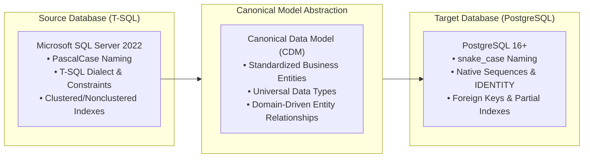
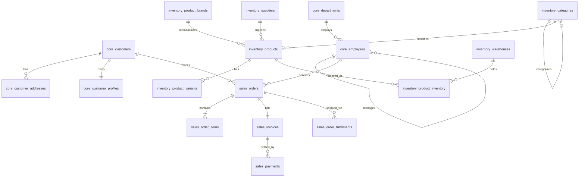

# Canonical Data Model (CDM) Specification

## 1. Executive Summary & Design Philosophy

The **Canonical Data Model (CDM)** provides an abstraction layer between vendor-specific source database implementations (Microsoft SQL Server) and target database implementations (PostgreSQL or cloud data warehouses). 

Rather than tightly coupling the migration pipeline to SQL Server's proprietary data types (`DATETIME2`, `UNIQUEIDENTIFIER`, `BIT`, `IDENTITY(1,1)`), the migration follows an **Enterprise Data Architecture pattern**:



### Key Architectural Benefits:
1. **Decoupling**: Decouples schema extraction from schema generation. Source vendors can be swapped or updated without touching the PostgreSQL generator.
2. **Standardization**: Enforces corporate naming conventions (`snake_case` in target), standardized temporal types (`TIMESTAMPTZ`), and universal key formats (`UUID`, `BIGINT IDENTITY`).
3. **Traceability**: Every target table and column maintains a direct, auditable provenance back to its canonical business attribute and source physical column.
4. **Extensibility**: The CDM can be ingested by OpenAPI generators, Data Catalogs (e.g. DataHub, Collibra), and analytics pipelines.

---

## 2. Core Business Domains & Canonical Entities

The system encapsulates **Enterprise E-Commerce and Supply Chain ERP** workflows divided into four distinct business domains:

```
┌────────────────────────────────────────────────────────────────────────┐
│                      CANONICAL BUSINESS DOMAINS                        │
├───────────────────┬───────────────────┬───────────────────┬────────────┤
│ Party & Core      │ Inventory & Supply│ Sales & Commerce  │ Governance │
├───────────────────┼───────────────────┼───────────────────┼────────────┤
│ • Country         │ • Supplier        │ • PriceList       │ • AuditLog │
│ • Customer        │ • Category        │ • Promotion       │ • SysConfig│
│ • CustomerAddress │ • Brand           │ • SalesOrder      │            │
│ • CustomerProfile │ • Warehouse       │ • OrderItem       │            │
│ • Department      │ • Product         │ • OrderDiscount   │            │
│ • Employee        │ • ProductVariant  │ • Fulfillment     │            │
│                   │ • InventoryStock  │ • Invoice         │            │
│                   │ • InventoryTx     │ • Payment         │            │
│                   │                   │ • OrderNote       │            │
│                   │                   │ • CustomerReview  │            │
└───────────────────┴───────────────────┴───────────────────┴────────────┘
```

### Domain 1: Party & Enterprise Core (`core`)
- **`Country`**: ISO reference master for countries and currencies.
- **`Customer`**: Master entity representing commercial clients and individual consumers. Includes global UUID, tax identification, and risk limits.
- **`CustomerAddress`**: Multi-address management (Billing, Shipping, Office) associated with customers.
- **`CustomerProfile`**: 1:1 extension containing loyalty program tiers, points, preferences, and authentication telemetry.
- **`Department`**: Enterprise organizational unit with operational cost tracking.
- **`Employee`**: Corporate workforce master with hierarchical management tree (`ManagerEmployeeID` self-referential foreign key) and compensation terms.

### Domain 2: Inventory & Logistics (`inventory`)
- **`Supplier`**: Vendor master with performance ratings and credit terms.
- **`Category`**: Multi-level product classification hierarchy (`ParentCategoryID` recursive tree).
- **`ProductBrand`**: Commercial trademarks and brand profiles.
- **`Warehouse`**: Physical fulfillment centers and bonded storage facilities.
- **`Product`**: Master catalog item defining dimensions, weights, default pricing, and primary supply sources.
- **`ProductVariant`**: Stock keeping units (SKUs) representing physical variations (size, color, material).
- **`ProductInventory`**: Multi-location inventory balances with reorder and safety thresholds (Composite PK: `ProductID`, `WarehouseID`).
- **`InventoryTransaction`**: Immutable double-entry ledger tracking physical stock receipts, shipments, transfers, and adjustments.

### Domain 3: Commercial & Order Management (`sales`)
- **`PriceList`**: Tiered price catalogs with temporal validity periods.
- **`Promotion`**: Marketing incentive rules with discount percentage thresholds.
- **`SalesOrder`**: Master transaction document orchestrating fulfillment, status progression, billing, and shipping destinations.
- **`OrderItem`**: Detailed order line items with discrete quantities, unit prices, and line discounts.
- **`OrderDiscount`**: Promotion allocation junction table linking marketing campaigns to orders.
- **`OrderFulfillment`**: Logistics tracking recording carriers, tracking numbers, and delivery milestones.
- **`Invoice`**: Accounts receivable bill with net terms, tax breakdowns, and remaining balances.
- **`Payment`**: Financial remittance settlement linking to invoices with external transaction references.
- **`OrderNote`**: Operational collaboration log for customer support and fulfillment agents.
- **`CustomerReview`**: Post-purchase product feedback with verification flags.

### Domain 4: Governance & Auditing (`audit`)
- **`AuditLog`**: System-wide CDC (Change Data Capture) log recording operational mutations.
- **`SystemConfiguration`**: Dynamic key-value environment settings and runtime parameters.

---

## 3. Universal Canonical Data Types

The Canonical Model defines 15 abstract data types that normalize physical platform differences:

| Canonical Type | T-SQL Physical Type | PostgreSQL Target Type | Semantic Meaning |
| :--- | :--- | :--- | :--- |
| `INTEGER_16` | `SMALLINT` | `SMALLINT` | 16-bit signed integer |
| `INTEGER_32` | `INT` | `INTEGER` | 32-bit signed integer |
| `INTEGER_64` | `BIGINT` | `BIGINT` | 64-bit signed integer |
| `SMALL_INT` | `TINYINT` | `SMALLINT` | 8-bit unsigned integer (promoted in PG) |
| `BOOLEAN` | `BIT` | `BOOLEAN` | Binary flag (`TRUE`/`FALSE`) |
| `DECIMAL` | `DECIMAL(p,s)`, `NUMERIC(p,s)` | `NUMERIC(p,s)` | Exact fixed-point numeric representation |
| `MONEY_DECIMAL` | `MONEY`, `SMALLMONEY` | `NUMERIC(19,4)` | Currency amounts with fixed scale |
| `FLOAT_32` | `REAL` | `REAL` | Single-precision floating point |
| `FLOAT_64` | `FLOAT` | `DOUBLE PRECISION` | Double-precision floating point |
| `FIXED_STRING` | `CHAR(n)`, `NCHAR(n)` | `CHAR(n)` | Fixed-width string |
| `VARIABLE_STRING`| `VARCHAR(n)`, `NVARCHAR(n)` | `VARCHAR(n)` | Variable-length string with upper bound |
| `LONG_TEXT` | `TEXT`, `NTEXT`, `NVARCHAR(MAX)`| `TEXT` | Unbounded textual content |
| `DATE` | `DATE` | `DATE` | Calendar date (no time component) |
| `TIME` | `TIME` | `TIME` | Wall-clock time (no time zone) |
| `TIMESTAMP_TZ` | `DATETIME2`, `DATETIMEOFFSET` | `TIMESTAMPTZ` | High-precision UTC timestamp |
| `UUID` | `UNIQUEIDENTIFIER` | `UUID` | RFC 4122 universal identifier |
| `BINARY` | `VARBINARY`, `IMAGE`, `BINARY` | `BYTEA` | Raw binary octet stream |
| `XML` | `XML` | `XML` | XML structured document |
| `JSON` | `NVARCHAR(MAX)` (JSON stored) | `JSONB` | Structured JSON document / binary JSON |

---

## 4. Entity-Relationship Architecture (Key Flows)


